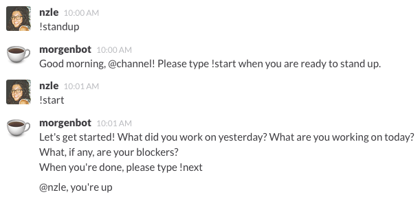

# Morgenbot
Good morning! Morgenbot is a [Slack](https://slack.com/) standup bot. ☕



## Installation

1. Clone the repo
2. `pip install -r requirements.txt`
3. Host the web app on [Heroku](http://heroku.com):

    ```
    heroku create
    git push heroku master
    heroku ps:scale web=1
    heroku logs
    ```
4. Set up some config variables using `heroku config:set VARIBLE=value`:
   - `TOKEN`: your team's Slack API token. (required)
   - `USERNAME`: your bot's username. (optional; defaults to `'morgenbot'`)
   - `ICON_EMOJI`: the emoji used in the bot's icon. (optional; defaults to `':coffee:'`)
   - `CHANNEL`: the channel in which you stand up. (optional; defaults to `'#standup'`)
   - `IGNORE_USERS`: a string representing a comma-separated array of strings representing active channel users who never stand up. (eg `'["username1", "username2"]'`; optional; defaults to `''`)
   - `INIT_GREETING`: the way Morgenbot greets you when a standup is initialized. (optional; defaults to `'Good morning'`)
   - `START_MESSAGE`: the instructions Morgenbot issues when a standup starts. (optional; defaults to `'What did you work on yesterday? What are you working on today? What, if any, are your blockers?'`)
   - `GIPHY`: a string representing a boolean of whether you want to use Giphy on queries Morgenbot doesn't understand. (optional; defaults to `FALSE`)
5. Add the URL where the web app is deployed as an [outgoing webhook](https://my.slack.com/services/new/outgoing-webhook) in Slack. Don't forget the trailing `/`!
6. Type `!standup` in your chosen channel to start a new standup. (Need help? Type `!help`.)

## Alternate Installation (Docker)

1. Clone the repo
2. Install the latest version of [Docker Toolbox](https://www.docker.com/toolbox) for local development and testing
3. Run `docker-compose up` to build the container
4. Environment variables can be set via the `.env` file (a sample `.env.example` file is included)

The container itself can be deployed to any Docker compatible host.

## Thanks
This project takes its inspiration from [tender](https://github.com/markpasc/tender), a standup bot for IRC; leaned heavily on [Slask](https://github.com/llimllib/slask) for its implementation of Flask; and uses the [Slack API](https://api.slack.com/) via the Python wrapper [Slacker](https://github.com/os/slacker). Thank you.

## Contributors
* @eelzon
* @alexbain
